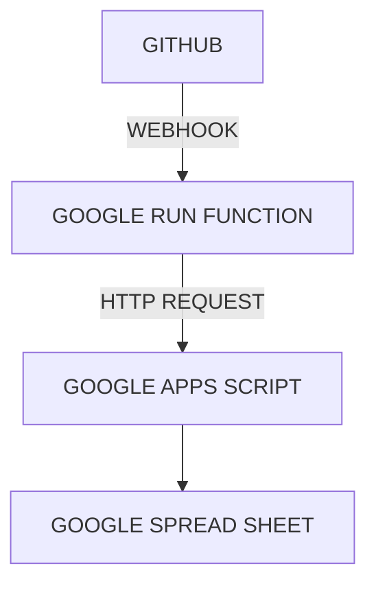

## HOW DO I LOOK 프로젝트 개발 보고서

**작성자**: 박규남

### 구현 기능 \/ 요소 목록

| 기능/요소 이름                                |
| :-------------------------------------------- |
| [GITHUB ISSUE 와 GOOGLE SPREADSHEET 연동](/#) |
| [GITHUB ISSUE 탬플릿 구현](/#)                |
| [GITHUB PR 와 DISCORD 연동](/#)               |
| [DTO 미들웨어 구현](/#)                       |
| [GLOBAL ERROR HANDLER 미들웨어 구현](/#)      |
| [TAG API 구현](/#)                            |
| [LOG API 구현](/#)                            |
| [HEALTHCHECK API 구현](/#)                    |
| [SWAGGER 연동](/#)                            |
| [프론트엔드 와 백엔드 배포](/#)               |

### GITHUB ISSUE 와 GOOGLE SPREAD SHEET 연동

#### 기능 개요



#### 구현 목표

1. Github Issue -> Webhook -> Google Run Function

2. Google Run Function\(Node.js, Axios\) -> Google Apps Script

3. Google Apps Script -> Google Spreadsheet

#### 기술 스택 및 도구

| 기술 스택                          | 서비스 제공자 |
| :--------------------------------- | ------------- |
| Github Webhook                     | Github        |
| Google Run Function(Node.js/Axios) | Google        |
| Google Apps Script(js)             | Google        |

#### 구현 방식 / 로직

1. Github Token 발급

   단 한번만 보이기 때문에 별도의 장소에 저장해서 관리한다.

2. Google Apps Script 작성

   단순하게 GET 요청으로 JSON 을 받아온다.

   ```js
   // PSEUDOCODE
   GITHUB_TOKEN = 'ghp_{ID}';
   GITHUB_OWNER = '{NICKNAME}';
   GITHUB_REPO = '{REPOSITORY_NAME}';
   GITHUB_NICKNAMES = {
     NICKNAME: 'NAME',
   };

   allIssues = [];

   url = `https://api.github.com/repos/${GITHUB_OWNER}/${GITHUB_REPO}/issues?state=all&per_page=100&page=${page}`;

   options = {
     method: 'get',
     headers: {
       Authorization: `token ${GITHUB_TOKEN}`,
       Accept: 'application/vnd.github+json',
     },
     muteHttpExceptions: true,
   };

   response = UrlFetchApp.fetch(url, options);

   result = JSON.parse(response.getContentText());

   // 받아온 JSON 을 바탕으로 allIssues 에 저장
   loop {
     allIssues.push({
       number: issue.number,
       author: issue.user ? mapGithubUser(issue.user.login) : '알 수 없음',
       labels: otherLabels,
       labelsStr: otherLabels.join(', '),
       title: issue.title,
       progress: progress,
       startDate: startDate,
       endDate: endDate,
     });
   }

   // 각각의 ROW에 처리된 값 입력
   loop {
    sheet.getRange(row, 1).setValue(issue.{KEYWORD});
    // ...
   }

   // 배포할 때 아래 함수를 배포해서 URL 호출로
   // 함수를 동작할 수 있습니다.
   doByGoogleRunFunction(e) {
     // 로직 함수
     return ContentService.createTextOutput("OK");
   }
   ```

   단순히 이 스크립트를 실행하기만 해도 비동기적으로 Github 의 Issue 목록을 받아와서 최신화를 잘 해준다.

   다만, 실시간으로 동기화 하는 것을 목표로 했기 때문에, 이제 이 **doByGoogleRunFunction(e)** 을 호출할 방법을 찾아야 한다.

   보안상의 이유로 Google Apps Script 는 직접적으로 웹서버를 구현할 수가 없다. 그래서 별도로 중계해주는 역할을 하는 웹서버를 만들어서 Google Apps Script 함수를 실행하는 URL 로 던져줘야 한다.

3. Google Run Function 작성

   구글에서 만든 컨테이너화 된 애플리케이션을 서버리스 방식으로 배포하고 실행할 수 있는 완전 관리형 플랫폼이다.

   즉, 컨테이너 이미지로 만들어서 업로드만 하면, 구글이 알아서 자동 확장, 로드 밸런싱 들 운영 관련된 작업을 알아서 처리해준다.

   매월 요청 200만개가 무료로 제공된다.

   그중 Function 은 단순하게 하나의 함수만 동작하면 될 때 사용하기 좋다.

   이번에는 Github 의 Webhook 을 받아서 Google Apps Script 로 전달하는 단순한 역할만 하면 되기 때문에 Function 을 선택했다.

   위에서 만들었던 **배포 URL** 에 POST 로 보내주는 간단한 API 서버를 Node.js 와 Axios 로 구현한다.

   ```js
   // PSEUDOCODE
   const APPS_SCRIPT_URL = 'https://script.google.com/macros/s/{ID}';

   export githubWebhook = async (req, res) => {
     await axios.post(APPS_SCRIPT_URL);
     res.status(200).send('OK');
   };
   ```

   단, 함수 진입점은 export 하는 함수 이름을 동일하게 맞춰야 한다. 이번에는 **githubWebhook** 이 함수 진입점이다.

4. Github Webhook 설정

   이제 위에서 만든 Google Run Function 의 URL 을 Github Webhook 을 생성할 때 넣어주면 된다.

#### 문제 및 해결 과정

1. Google Apps Script 는 무겁지만, 조건부 서식이 더 무겁다.

   실시간 동기화를 목표로 했지만, 생각보다 즉시 바뀐다는 인상은 받지 못했다.

   물론, Webhook 이 정상적으로 잘 동작하고 있고, 평균 4~5초 정도면 최신화가 되는 것을 확인할 수 있었다.

   4~5초 정도로도 충분한 동작 시간이긴 했지만, 좀 더 빠르게 할 수 없을까 싶어서 여러가지 방법을 시도해보았는데 의외의 사실을 하나 발견했다.

   구글 시트 전체를 다 지우고 새로 데이터를 기입하나, 부분적으로 수정하나 큰 차이가 없었다. 물론, 차이는 발생한다. 한 1초 차이 정도?

   대신 부분적으로 수정하는 것은 더 고려사항이 많다. 특히 Issue 가 많이 만들어질 때에는 동시에 2~3개 씩 만들어졌는데, 이 Apps Script 가 느려서 꼬이는 경우가 많이 발생했다. 그리고 시트 특성상 꼬이면 나머지 데이터들도 망가지는 경우가 많았다.

   그래서 그냥 꼬이는 부분이 발생하지 않도록, 아예 모든 데이터를 지웠다가 다시 대입하는 것으로 했다. 의외로 이 단계에서는 부분 수정이나 전체 데이터 새로 대입하는 거나 사실 거의 차이점이 없다.

   차이점은 **조건부 서식** 에서 발생한다.

   조건부 서식이 엄청나게 느리다! Issue 가 늘면 늘수록 이 변화하는 시간이 더 걸린다는 것을 알 수 있다.

#### 성과 및 결과

1. Github Webhook 사용법을 학습했다.

2. Google Run Function 사용법을 학습했다.

3. Google AppScript 사용법을 학습했다.

4. 사용자는 Github Issue 만 작성하면 되도록 자동화되었다.

### GITHUB ISSUE 템플릿 구현

#### 기능 개요

공통적으로 사용되는 Issue 의 항목을 템플릿화 하여 제공한다.

#### 구현 목표

1. 정해진 규칙에 따른 템플릿 작성

2. Google Spreadsheet 연동

#### 기술 스택 및 도구

| 기술 스택             | 서비스 제공자 |
| :-------------------- | ------------- |
| Github ISSUE_TEMPLATE | Github        |

#### 구현 방식 / 로직

1. /.github/ISSUE_TEMPLATE/

   ISSUE_TEMPLATE 디렉토리를 만들고 내부에 .md 파일을 생성하면, Github 에서 Issue 를 생성할 때 선택지가 표시된다.

   

2. todo-template.md

   처음 설계했을 때는 Commit 컨벤션에 따른 키워드를 \[\] 에 넣을 예정이었다.

   근데, 나중에 코드잇 협업 규칙들 중에 \'\[이름\]\' 으로 적는 규칙을 발견해서 TODO 대신 이름을 적는 것으로 통일했다.

   코드는 따로 수정할 필요는 없어 보여서 TODO 그대로 두기로 했다.

   ```md
   ---
   name: 기본 TODO
   about: 시작/종료 날짜가 포함된 업무를 등록합니다.
   title: '[TODO] '
   labels: []
   assignees: []
   ---

   ### 시작날짜

   2025-06-02

   ### 종료날짜

   2025-06-20

   ---

   ### 할 일 내용

   - [ ] 할 일 1
   - [ ] 할 일 2
   ```

#### 문제 및 해결 과정

1. default 브랜치에 올라가야 동작한다.

   1팀은 기본적으로 dev 브랜치에 작업하고, 안정화 버전만 main 브랜치에 올리는 것이 규칙이었다.

   그래서 todo-template.md 을 dev 까지만 올리고 테스트를 진행했는데, Issue 를 만들 때 템플릿이 표시가 되지 않았다.

   이리저리 찾아보니, 이런 템플릿은 default 브랜치, 즉, 1팀 기준 main 브랜치에 올라가야 동작한다는 것을 알 수 있었다.

   main 브랜치에 올리니 문제없이 동작했다.

#### 성과 및 결과

1. 모두가 동일한 템플릿으로 Issue 를 작성할 수 있다.

2. Gantt 시트가 실시간으로 동기화 되었다.

### GITHUB PR - DISCORD 연동

#### 기능 개요

#### 구현 목표

#### 기술 스택 및 도구

#### 구현 방식 / 로직

#### 문제 및 해결 과정

#### 성과 및 결과

### DTO 미들웨어 구현

#### 기능 개요

#### 구현 목표

#### 기술 스택 및 도구

#### 구현 방식 / 로직

#### 문제 및 해결 과정

#### 성과 및 결과

### TAG API 구현

#### 기능 개요

#### 구현 목표

#### 기술 스택 및 도구

#### 구현 방식 / 로직

#### 문제 및 해결 과정

#### 성과 및 결과

### LOG API 구현

#### 기능 개요

#### 구현 목표

#### 기술 스택 및 도구

#### 구현 방식 / 로직

#### 문제 및 해결 과정

#### 성과 및 결과

### 프론트엔드 - 백엔드 연동 및 배포

#### 기능 개요

#### 구현 목표

#### 기술 스택 및 도구

#### 구현 방식 / 로직

#### 문제 및 해결 과정

#### 성과 및 결과

```

```
