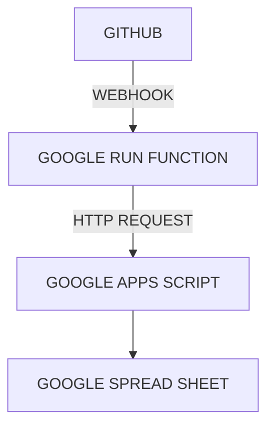
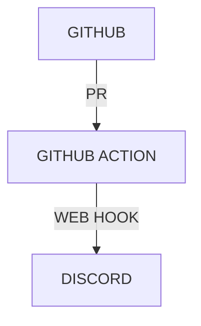
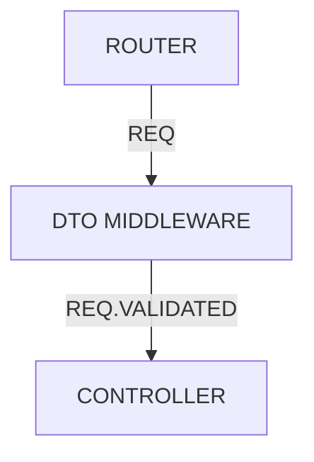
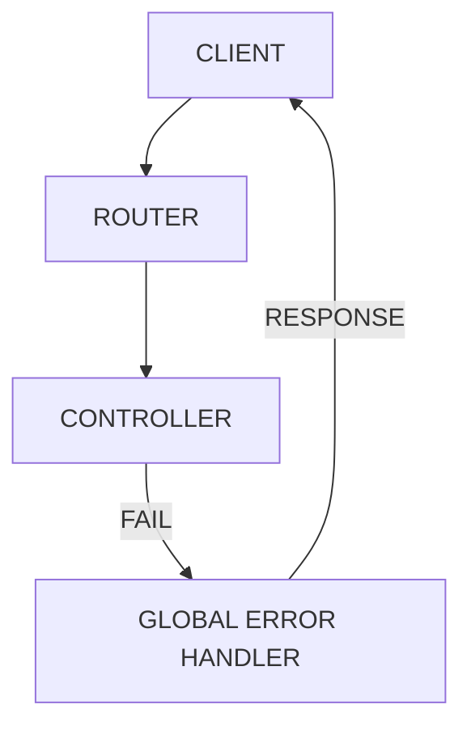
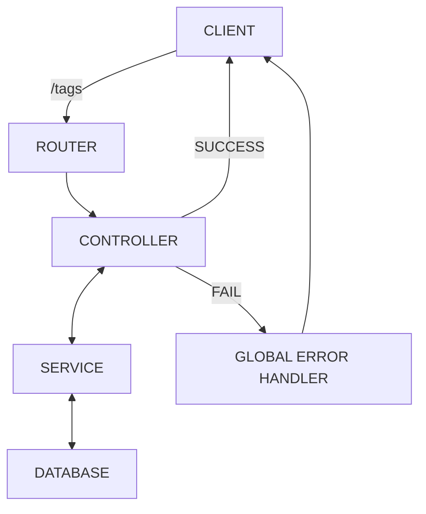
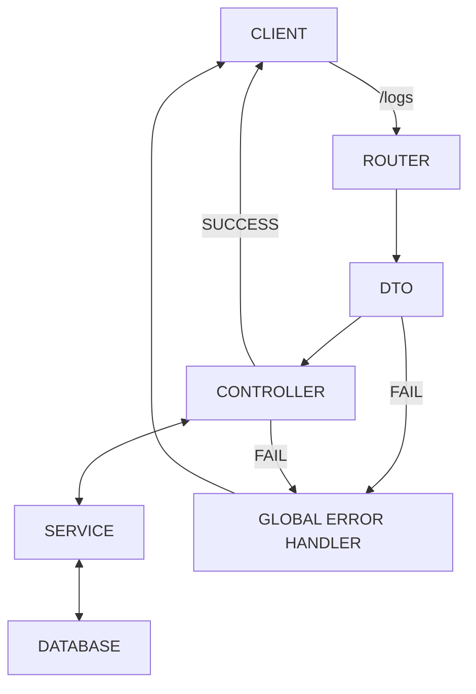
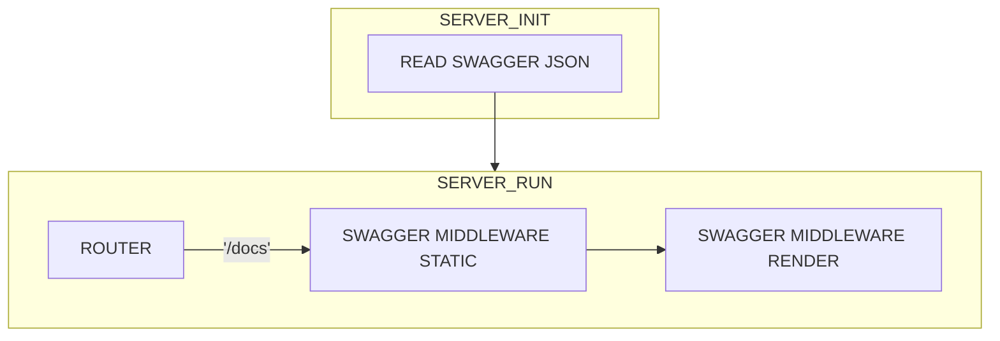
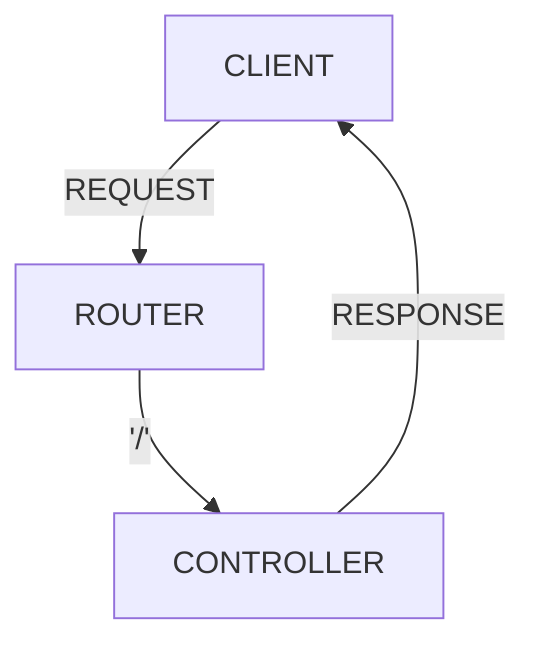
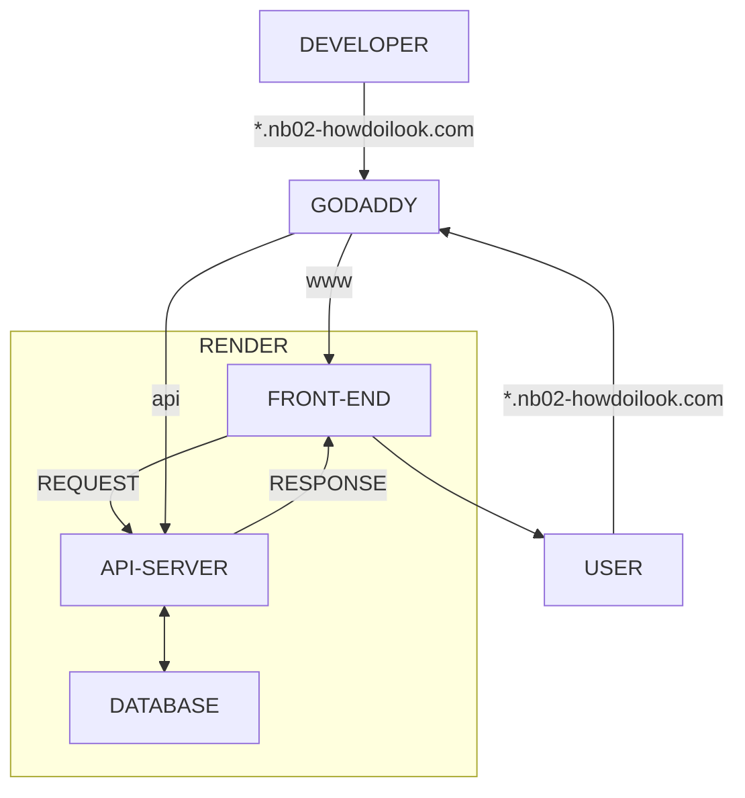

## HOW DO I LOOK 프로젝트 개발 보고서

**작성자**: 박규남

**저장소**: [https://github.com/gyunam-bark/nb02-how-do-i-look-team1](https://github.com/gyunam-bark/nb02-how-do-i-look-team1)

**프론트엔드**: [www.nb02-howdoilook.com](https://www.nb02-howdoilook.com)

**백엔드**: [api.nb02-howdoilook.com/docs](https://api.nb02-howdoilook.com/docs)

### 구현 기능 \/ 요소 목록

| 기능/요소 이름                                                                                                                         |
| :------------------------------------------------------------------------------------------------------------------------------------- |
| [GITHUB ISSUE 와 GOOGLE SPREADSHEET 연동](?tab=readme-ov-file#github-issue-%EC%99%80-google-spread-sheet-%EC%97%B0%EB%8F%99)           |
| [GITHUB ISSUE 탬플릿 구현](?tab=readme-ov-file#github-issue-%ED%85%9C%ED%94%8C%EB%A6%BF-%EA%B5%AC%ED%98%84)                            |
| [GITHUB PR 와 DISCORD 연동](?tab=readme-ov-file#github-pr---discord-%EC%97%B0%EB%8F%99)                                                |
| [DTO 미들웨어 구현](?tab=readme-ov-file#dto-%EB%AF%B8%EB%93%A4%EC%9B%A8%EC%96%B4-%EA%B5%AC%ED%98%84)                                   |
| [GLOBAL ERROR HANDLER 미들웨어 구현](?tab=readme-ov-file#global-error-handler-%EB%AF%B8%EB%93%A4%EC%9B%A8%EC%96%B4-%EA%B5%AC%ED%98%84) |
| [TAG API 구현](?tab=readme-ov-file#tag-api-%EA%B5%AC%ED%98%84)                                                                         |
| [LOG API 구현](?tab=readme-ov-file#log-api-%EA%B5%AC%ED%98%84)                                                                         |
| [SWAGGER 연동](?tab=readme-ov-file#swagger-%EC%97%B0%EB%8F%99)                                                                         |
| [HEALTHCHECK API 구현](?tab=readme-ov-file#swagger-%EC%97%B0%EB%8F%99)                                                                 |
| [배포](?tab=readme-ov-file#swagger-%EC%97%B0%EB%8F%99)                                                                                 |

### GITHUB ISSUE 와 GOOGLE SPREAD SHEET 연동

#### 기능 개요



#### 구현 목표

1. Github Issue -> Webhook -> Google Run Function

2. Google Run Function\(Node.js, Axios\) -> Google Apps Script

3. Google Apps Script -> Google Spreadsheet

#### 기술 스택 및 도구

| 기술 스택                          | 서비스 제공자 |
| :--------------------------------- | ------------- |
| Github Webhook                     | Github        |
| Google Run Function(Node.js/Axios) | Google        |
| Google Apps Script(js)             | Google        |

#### 구현 방식 / 로직

1. Github Token 발급

   단 한번만 보이기 때문에 별도의 장소에 저장해서 관리한다.

2. Google Apps Script 작성

   단순하게 GET 요청으로 JSON 을 받아온다.

   ```js
   // PSEUDOCODE
   GITHUB_TOKEN = 'ghp_{ID}';
   GITHUB_OWNER = '{NICKNAME}';
   GITHUB_REPO = '{REPOSITORY_NAME}';
   GITHUB_NICKNAMES = {
     NICKNAME: 'NAME',
   };

   allIssues = [];

   url = `https://api.github.com/repos/${GITHUB_OWNER}/${GITHUB_REPO}/issues?state=all&per_page=100&page=${page}`;

   options = {
     method: 'get',
     headers: {
       Authorization: `token ${GITHUB_TOKEN}`,
       Accept: 'application/vnd.github+json',
     },
     muteHttpExceptions: true,
   };

   response = UrlFetchApp.fetch(url, options);

   result = JSON.parse(response.getContentText());

   // 받아온 JSON 을 바탕으로 allIssues 에 저장
   loop {
     allIssues.push({
       number: issue.number,
       author: issue.user ? mapGithubUser(issue.user.login) : '알 수 없음',
       labels: otherLabels,
       labelsStr: otherLabels.join(', '),
       title: issue.title,
       progress: progress,
       startDate: startDate,
       endDate: endDate,
     });
   }

   // 각각의 ROW에 처리된 값 입력
   loop {
    sheet.getRange(row, 1).setValue(issue.{KEYWORD});
    // ...
   }

   // 배포할 때 아래 함수를 배포해서 URL 호출로
   // 함수를 동작할 수 있습니다.
   doByGoogleRunFunction(e) {
     // 로직 함수
     return ContentService.createTextOutput("OK");
   }
   ```

   단순히 이 스크립트를 실행하기만 해도 비동기적으로 Github 의 Issue 목록을 받아와서 최신화를 잘 해준다.

   다만, 실시간으로 동기화 하는 것을 목표로 했기 때문에, 이제 이 **doByGoogleRunFunction(e)** 을 호출할 방법을 찾아야 한다.

   보안상의 이유로 Google Apps Script 는 직접적으로 웹서버를 구현할 수가 없다. 그래서 별도로 중계해주는 역할을 하는 웹서버를 만들어서 Google Apps Script 함수를 실행하는 URL 로 던져줘야 한다.

3. Google Run Function 작성

   구글에서 만든 컨테이너화 된 애플리케이션을 서버리스 방식으로 배포하고 실행할 수 있는 완전 관리형 플랫폼이다.

   즉, 컨테이너 이미지로 만들어서 업로드만 하면, 구글이 알아서 자동 확장, 로드 밸런싱 들 운영 관련된 작업을 알아서 처리해준다.

   매월 요청 200만개가 무료로 제공된다.

   그중 Function 은 단순하게 하나의 함수만 동작하면 될 때 사용하기 좋다.

   이번에는 Github 의 Webhook 을 받아서 Google Apps Script 로 전달하는 단순한 역할만 하면 되기 때문에 Function 을 선택했다.

   위에서 만들었던 **배포 URL** 에 POST 로 보내주는 간단한 API 서버를 Node.js 와 Axios 로 구현한다.

   ```js
   // PSEUDOCODE
   const APPS_SCRIPT_URL = 'https://script.google.com/macros/s/{ID}';

   export githubWebhook = async (req, res) => {
     await axios.post(APPS_SCRIPT_URL);
     res.status(200).send('OK');
   };
   ```

   단, 함수 진입점은 export 하는 함수 이름을 동일하게 맞춰야 한다. 이번에는 **githubWebhook** 이 함수 진입점이다.

4. Github Webhook 설정

   이제 위에서 만든 Google Run Function 의 URL 을 Github Webhook 을 생성할 때 넣어주면 된다.

#### 문제 및 해결 과정

1. Google Apps Script 는 무겁지만, 조건부 서식이 더 무겁다.

   실시간 동기화를 목표로 했지만, 생각보다 즉시 바뀐다는 인상은 받지 못했다.

   물론, Webhook 이 정상적으로 잘 동작하고 있고, 평균 4~5초 정도면 최신화가 되는 것을 확인할 수 있었다.

   4~5초 정도로도 충분한 동작 시간이긴 했지만, 좀 더 빠르게 할 수 없을까 싶어서 여러가지 방법을 시도해보았는데 의외의 사실을 하나 발견했다.

   구글 시트 전체를 다 지우고 새로 데이터를 기입하나, 부분적으로 수정하나 큰 차이가 없었다. 물론, 차이는 발생한다. 한 1초 차이 정도?

   대신 부분적으로 수정하는 것은 더 고려사항이 많다. 특히 Issue 가 많이 만들어질 때에는 동시에 2~3개 씩 만들어졌는데, 이 Apps Script 가 느려서 꼬이는 경우가 많이 발생했다. 그리고 시트 특성상 꼬이면 나머지 데이터들도 망가지는 경우가 많았다.

   그래서 그냥 꼬이는 부분이 발생하지 않도록, 아예 모든 데이터를 지웠다가 다시 대입하는 것으로 했다. 의외로 이 단계에서는 부분 수정이나 전체 데이터 새로 대입하는 거나 사실 거의 차이점이 없다.

   차이점은 **조건부 서식** 에서 발생한다.

   조건부 서식이 엄청나게 느리다! Issue 가 늘면 늘수록 이 변화하는 시간이 더 걸린다는 것을 알 수 있다.

#### 성과 및 결과

1. Github Webhook 사용법을 학습했다.

2. Google Run Function 사용법을 학습했다.

3. Google AppScript 사용법을 학습했다.

4. 사용자는 Github Issue 만 작성하면 되도록 자동화되었다.

### GITHUB ISSUE 템플릿 구현

#### 기능 개요

공통적으로 사용되는 Issue 의 항목을 템플릿화 하여 제공한다.

#### 구현 목표

1. 정해진 규칙에 따른 템플릿 작성

2. Google Spreadsheet 연동

#### 기술 스택 및 도구

| 기술 스택             | 서비스 제공자 |
| :-------------------- | ------------- |
| Github ISSUE_TEMPLATE | Github        |

#### 구현 방식 / 로직

1. /.github/ISSUE_TEMPLATE/

   ISSUE_TEMPLATE 디렉토리를 만들고 내부에 .md 파일을 생성하면, Github 에서 Issue 를 생성할 때 선택지가 표시된다.

   

2. todo-template.md

   처음 설계했을 때는 Commit 컨벤션에 따른 키워드를 \[\] 에 넣을 예정이었다.

   근데, 나중에 코드잇 협업 규칙들 중에 \'\[이름\]\' 으로 적는 규칙을 발견해서 TODO 대신 이름을 적는 것으로 통일했다.

   코드는 따로 수정할 필요는 없어 보여서 TODO 그대로 두기로 했다.

   ```md
   ---
   name: 기본 TODO
   about: 시작/종료 날짜가 포함된 업무를 등록합니다.
   title: '[TODO] '
   labels: []
   assignees: []
   ---

   ### 시작날짜

   2025-06-02

   ### 종료날짜

   2025-06-20

   ---

   ### 할 일 내용

   - [ ] 할 일 1
   - [ ] 할 일 2
   ```

#### 문제 및 해결 과정

1. default 브랜치에 올라가야 동작한다.

   1팀은 기본적으로 dev 브랜치에 작업하고, 안정화 버전만 main 브랜치에 올리는 것이 규칙이었다.

   그래서 todo-template.md 을 dev 까지만 올리고 테스트를 진행했는데, Issue 를 만들 때 템플릿이 표시가 되지 않았다.

   이리저리 찾아보니, 이런 템플릿은 default 브랜치, 즉, 1팀 기준 main 브랜치에 올라가야 동작한다는 것을 알 수 있었다.

   main 브랜치에 올리니 문제없이 동작했다.

#### 성과 및 결과

1. 모두가 동일한 템플릿으로 Issue 를 작성할 수 있다.

2. Gantt 시트가 실시간으로 동기화 되었다.

### GITHUB PR - DISCORD 연동

#### 기능 개요



#### 구현 목표

1. Github PR -> Github Action\(pr-to-discord.yml\)

2. Github Action -> Discord(@리뷰어 맨션)

#### 기술 스택 및 도구

| 기술 스택       | 서비스 제공자 |
| :-------------- | ------------- |
| Github Action   | Github        |
| Discord Webhook | Discord       |

#### 구현 방식 / 로직

1. /.github/workflows/

   이 경로는 오타없이 정확하게 생성 되어야 한다.

2. pr-to-discord.yml

   Github Secret 에 팀원들의 NICKNAME : DISCORD_ID 를 맵핑해서 저장한 데이터를 가져와서 PR 의 정보와 대조해서 리뷰어 @맨션으로 보낸다.

   ```yml
   name: Notify Reviewers on PR

   on:
      workflow_dispatch:
      pull_request:
    types: [opened, reopened, ready_for_review]

    jobs:
   notify-discord:
    runs-on: ubuntu-latest

    steps:
      - name: Get PR reviewers
        id: reviewers
        env:
          GITHUB_TOKEN: ${{ secrets.GITHUB_TOKEN }}
        run: |
          set -euo pipefail

          PR_NUMBER="${{ github.event.pull_request.number }}"
          REPO="${{ github.repository }}"

          echo "Fetching reviewers for PR #$PR_NUMBER from $REPO"

          API_RESPONSE=$(gh api repos/$REPO/pulls/$PR_NUMBER 2>err.log || echo "")
          if [ -s err.log ]; then
            echo "Error from GitHub API:"
            cat err.log
          fi

          if [ -z "$API_RESPONSE" ]; then
            REVIEWERS="[]"
          else
            # 안정적으로 리뷰어 목록 파싱 (null 및 빈 배열 모두 처리)
            REVIEWERS=$(echo "$API_RESPONSE" | jq -c '[.requested_reviewers?[]?.login] // []')
          fi

          echo "Reviewers JSON: $REVIEWERS"

          # base64 인코딩하여 GitHub Actions output으로 전달
          REVIEWERS_B64=$(echo "$REVIEWERS" | base64)
          echo "reviewers_b64=$REVIEWERS_B64" >> "$GITHUB_OUTPUT"

      - name: Notify Discord
        env:
          DISCORD_WEBHOOK_URL: ${{ secrets.DISCORD_WEBHOOK_URL }}
          USER_MAP: ${{ secrets.USER_MAP }} # 예: {"alice": "1234", "bob": "5678"}
        run: |
          set -euo pipefail

          PR_TITLE="${{ github.event.pull_request.title }}"
          PR_URL="${{ github.event.pull_request.html_url }}"

          # base64 디코딩 후 JSON 배열로 파싱
          REVIEWERS_JSON=$(echo "${{ steps.reviewers.outputs.reviewers_b64 }}" | base64 --decode)
          echo "Parsed reviewers: $REVIEWERS_JSON"

          MENTION_LIST=""
          for user in $(echo "$REVIEWERS_JSON" | jq -r '.[]'); do
            DISCORD_ID=$(echo "$USER_MAP" | jq -r --arg u "$user" '.[$u] // empty')
            if [ -n "$DISCORD_ID" ]; then
              MENTION_LIST="$MENTION_LIST <@$DISCORD_ID>"
            else
              MENTION_LIST="$MENTION_LIST @$user"
            fi
          done

          if [ -z "$MENTION_LIST" ]; then
            MENTION_LIST="(리뷰어가 지정되지 않았습니다)"
          fi

          curl -X POST "$DISCORD_WEBHOOK_URL" \
            -H "Content-Type: application/json" \
            -d @- <<EOF
          {
            "content": "${MENTION_LIST}\n새로운 Pull Request: **${PR_TITLE}**\n${PR_URL}"
          }
          EOF

   ```

#### 문제 및 해결 과정

1. 타겟 브랜치에 올라가야 동작한다.

   위의 Issue 와 다르게 PR 은 PR 이 보내지는 대상 브랜치에 올라가 있어야 한다.

   처음에는 Issue 와 동일할 것이라 생각해서, main 에 올렸는데 동작을 안 했다. 엄밀히 말하면, 개발도중에는 dev 브랜치에 PR 을 보내니까 main 에 PR 을 보내지 않아서 알림이 동작하지 않았던 것이다.

   다시 이 변동사항은 dev 에 올리니, dev 브랜치에 PR 이 될 때 마다 동작했다.

2. folk 한 저장소는 별개의 저장소로 취급한다.

   내가 테스트할 때에는 동작했는데, 몇몇 팀원들에게서 동작하지 않는 이슈가 있었다.

   깃허브가 남긴 로그를 틈 날 때마다 확인해보니, folk 한 저장소에서 PR 을 보낼 때 발생한다는 공통점을 확인 할 수 있었다.

   folk 한 저장소에서 PR 알림이 실패했던 이유는 Secret 값이 없었기 때문이었다. 깃허브 Secret 값은 저장소에 종속되어서 관리되는데, folk 한 저장소는 고유한 ID 가 새로 할당되는 완전 별개의 저장소였고, yml 이 동작할 때 이 Secret 값을 바탕으로 동작하기에 에러가 발생하는 것이었다.

   결국 팀원들에게 가능한 origin 저장소에서 작업해달라고 안내해서 이 문제를 해결했다.

#### 성과 및 결과

1. PR 이 생성되면 디스코드에 알림이 온다.

   리뷰어로 등록된 팀원 이름이 맨션되어 본인의 맨션이 있을 때만 봐도 된다.

### DTO 미들웨어 구현

#### 기능 개요



#### 구현 목표

1. Router -> DTO Middleware -> Controller

#### 기술 스택 및 도구

| 기술 스택   | 서비스 제공자  |
| :---------- | -------------- |
| superstruct | ianstormtaylor |

#### 구현 방식 / 로직

1. coerce 자료형 정의

   ```js
   const stringToInteger = (value) => {
     const integer = Number(value);
     if (!Number.isInteger(integer)) {
       throw new Error(`${value} is not an integer`);
     }
     return integer;
   };

   const integer = coerce(number(), string(), stringToInteger);
   ```

   javascript 는 기본적으로 float 형태로 숫자를 저장하기 때문에, 따로 정수인지 확인하고, 숫자로 변환하는 coerce 자료형을 만들었다.

2. req.validated = {} 형태로 Controller 에 전달

   ```js
   req.validated = {
     body: schema.body ? create(req.body ?? {}, schema.body) : undefined,
     query: schema.query ? create(req.query ?? {}, schema.query) : undefined,
     params: schema.params ? create(req.params ?? {}, schema.params) : undefined,
   };
   ```

#### 문제 및 해결 과정

1. coerce 가 들어간다면 create 를 사용해야 한다.

   superstruct 문서상으로는 validate 의 option 에 coerce 를 포함하는 게 있지만, 제대로 동작하지 않는다.

   그래서 차라리 맘편하게 coerce 가 들어갈 만한 가능성이 높다면, 그냥 create 로 처리하는 게 효율적이다.

   다만, validate 와 달리 create 는 에러 반환값을 주지 않기 때문에, 별도로 아래와 같이 에러 처리를 해줘야 한다.

   ```js
   if (error instanceof StructError) {
     error.statusCode = 400;
     error.message = undefined;
   }
   ```

#### 성과 및 결과

1. Controller 는 req.validated 로 검증 및 변환된 요청 파라미터를 사용하기만 하면 된다.

### GLOBAL ERROR HANDLER 미들웨어 구현

#### 기능 개요



#### 구현 목표

1. API 서버에서 발생하는 모든 에러를 처리하는 미들웨어

#### 기술 스택 및 도구

| 기술 스택  | 서비스 제공자 |
| :--------- | ------------- |
| statusCode | MDN           |

#### 구현 방식 / 로직

1. 모든 라우터가 use 된 뒤에 use 된다.

2. 고정된 메세지 값이 출력되도록, statusCode 별 메시지를 맵핑한다.

3. API 명세서 대로 에러를 출력하도록 message 값이 있을 경우 덮어씌운다.

4. 에러가 발생했을 경우, 데이터베이스에 Log 를 저장한다.

#### 문제 및 해결 과정

1. 산발적인 statusCode 사용

   에러 로그를 저장하다가 간혹 나와서는 안되는 에러 코드가 발생해서 확인해보니, API 명세서와 다르게 작업한 API 들이 있었다.

   그래서 API 명세서에서 사용되는 에러코드와 상황을 정리해서 공유함으로써 에러 코드를 통일했다.

#### 성과 및 결과

1. 에러가 발생할 경우 Global Error Handler 에서 모든 에러를 처리하고 저장한다.

### TAG API 구현

#### 기능 개요



#### 구현 목표

1. Router -> Controller -> Service

#### 기술 스택 및 도구

#### 구현 방식 / 로직

1. 프론트 엔드 코드에 따른 반환값

   ```json
   {
     "tags": ["string"]
   }
   ```

#### 문제 및 해결 과정

1. API 명세서에 반환값이 기재되지 않은 이슈

   

   

   처음에는 단순하게 기존의 다른 API 들의 GET 명세서를 참고해서 만들었다.

   왜냐하면 다른 GET 명세서의 구조가 동일했기 때문에 당연히 /tags 도 동일한 구조를 사용할 것이라 생각했다.

   ```json
   {
     "totalItemCount": 0,
     "data": ["string"]
   }
   ```

   그런데 프론트 엔드와 연동하는 과정에서 계속 /tags 에서 에러가 발생했다.

   fetch 도 이상이 없었다.

   한참을 프론트 엔드 코드를 분석하고 나서야 에러가 발생하는 원인을 찾을 수 있었다. 프론트 엔드에서는 별도로 지정된 형식으로 /tags 를 받아오고 있었던 것이다.

   부랴부랴 프론트엔드가 원하는 형식으로 반환 형태를 수정하니 잘 동작했다.

   미리 프론트엔드 코드를 분석할 시간이 있었다면 미연에 방지할 수 있었을 문제긴 하지만, API 명세서를 바탕으로 백엔드 시스템을 구축하는 이번 프로젝트에서는 API 명세서 이슈는 치명적이었다고 생각한다.

#### 성과 및 결과

### LOG API 구현

#### 기능 개요

1. 서버 인스턴스를 재실행 할 때마다 Log 기록이 사라지는 문제를 해결하기 위해서 Log 를 데이터베이스에 저장하도록 시스템 구축.



#### 구현 목표

1. Router -> DTO -> Controller -> Service

#### 기술 스택 및 도구

#### 구현 방식 / 로직

1.  스키마 작성

    ```prisma
    model Log {
    logId      Int      @id @default(autoincrement())
    ip         String
    url        String
    method     String
    statusCode String
    message    String
    createdAt  DateTime @default(now())
    }
    ```

2.  Global Error Handler 에서 에러 발생 시 Log 저장

    ```js
    const saveLogToDatabse = async (req = {}, statusCode = '', message = '') => {
      const url = req.originalUrl || req.url || 'unknown';
      const method = req.method;
      const ip = req.ip || req.headers['x-forwarded-for'];

      await db.log.create({
        data: { ip, url, method, statusCode: String(statusCode), message },
      });
    };
    ```

3.  Log 반환값 설계

    ```json
    {
      "totalItemCount": 0,
      "data": [
        {
          "id": 1,
          "ip": "string",
          "url": "string",
          "method": "string",
          "statusCode": "string",
          "message": "string",
          "createdAt": "2025-06-18T05:14:21.995Z"
        }
      ]
    }
    ```

4.  프론트엔드 로그 페이지 추가

    프론트엔드 코드는 지적재산권 문제로 Private 저장소에 있기 때문에 구조와 api 로직 코드만 정리한다.

    - app/logs/page.tsx
    - app/logs/page.module.scss
    - libs/shared/navigation/GlobalNavigationBar.tsx
    - services/api.ts

      ```typescript
      export const getLogList = async ({
        page = 1,
        pageSize = 10,
        sortBy = SortByLog.latest,
        searchBy = '',
        keyword = '',
      }): Promise<PaginationResponse<LogType>> => {
        const query = new URLSearchParams({
          page: String(page),
          pageSize: String(pageSize),
          sortBy: String(sortBy),
          ...(searchBy ? { searchBy } : {}),
          ...(keyword ? { keyword } : {}),
        });

        const res = await fetch(`${BASE_URL}/logs?${query.toString()}`, {
          cache: 'no-store',
        });

        const data = await res.json();

        return data;
      };
      ```

#### 문제 및 해결 과정

1. 스키마 구조에 대한 고민

   기존의 Log 스키마는 아래와 같았다.

   ```prisma
   model Log {
    logId      Int      @id @default(autoincrement())
    detail     Json
    createdAt  DateTime @default(now())
    }
   ```

   이는 에러가 발생하는 원인에 따라서 형태가 다를 수 있다고 판단했었기 때문이다. 예를 들면 이미지 업로드와 일반 요청 은 다를 수도 있다고 생각했었다.

   근데 Log 를 몇 번 수집하고 나니, 애초에 API 명세서 대로 에러를 반환하고 있어서, 에러의 형태가 고정되어 있다는 것을 확인했다.

   그래서 검색 처리 속도도 높일 겸, 고정된 요소들을 테이블에 추가하는 방식으로 개선했다.

   ```prisma
    model Log {
    logId      Int      @id @default(autoincrement())
    ip         String
    url        String
    method     String
    statusCode String
    message    String
    createdAt  DateTime @default(now())
    }
   ```

#### 성과 및 결과

1. 이제 서버 인스턴스를 재시작해도 데이터베이스에 Log 가 남아있어서, 어떤 에러가 발생했을 때 찾아보기가 편리해졌다.

### SWAGGER 연동

#### 기능 개요



#### 구현 목표

1. 사용자가 '/docs' 엔드포인트로 접근하면 Swagger 문서가 나오도록 한다.

#### 기술 스택 및 도구

| 기술 스택          | 서비스 제공자 |
| :----------------- | ------------- |
| swagger-express-ui | swagger       |

#### 구현 방식 / 로직

1. 루트 디렉토리에 openapi.json 을 생성하고, API 명세서에 따라 작성한다.

2. swagger-express-ui 패키지를 설치하고, /docs 라우터에 미들웨어로 사용한다.

   ```js
   const docRouter = express.Router();

   docRouter.use('/', swaggerMiddlewareStatic, swaggerMiddlewareRender);

   export default docRouter;
   ```

#### 문제 및 해결 과정

1. openapi.json 작성

   귀찮아서 챝지피티에 맡길려고 했는데, API 명세서가 노션으로 되어있어서 챝지피티가 세부 명세서를 읽어오지 못했다.

   그래서 아래와 같이 API 를 하나씩 정리해서 적어주고 각각의 항목들을 받아서 추가하는 방법으로 작성했다.

   ```text
   /tags

   GET

   response(200)
   {
    "tags" : ["string"]
   }
   ```

#### 성과 및 결과

1. API 테스트를 Swagger 로 진행할 수 있다.

2. 서비스하는 API 목록과 어떤 파라미터가 필요한지 확인 할 수 있다.

### HEALTHCHECK API 구현

#### 기능 개요

1. Swagger 가 연동 됨에 따라 기존에 사용하던 자체 구현 API Tester 대신 서버 헬스체크로 기능 변경



#### 구현 목표

1. '/' 엔드포인트에 서버 헬스체크를 제공하는 API 개발

#### 기술 스택 및 도구

#### 구현 방식 / 로직

1. 헬스체크 반환값 설정

   ```json
   {
     "status": "OK",
     "uptime": 0,
     "timestamp": "2025-06-18T06:20:59.243Z"
   }
   ```

#### 문제 및 해결 과정

#### 성과 및 결과

1. API 서버가 동작 중인지 확인 할 때, '/' 엔드포인트로 헬스체크를 할 수 있다.

### 배포

#### 기능 개요



#### 구현 목표

1. 3 개의 인스턴스로 나눠서 배포

   - front-end : Next.js
   - back-end : Node.js + Express.js
   - database : postgresql

2. 커스텀 도메인 연동(DNS)

#### 기술 스택 및 도구

| 기술 스택 | 서비스 제공자 |
| :-------- | ------------- |
| Render    | render.com    |
| Godaddy   | godaddy       |
| Sharp     | lovell        |

#### 구현 방식 / 로직

1. 두 개의 인스턴스와 하나의 데이터베이스 생성

2. .env 정보를 각각의 프론트엔드, 백엔드 인스턴스 설정에 작성

3. 프론트엔드 next.config.js 에 외부 프로토콜 추가하여 권한 설정

4. 개발 중에는 프론트엔드 서버, DEV 백엔드 서버 로 테스트

5. 릴리즈 때 DEV 백엔드 서버의 저장소를 MAIN 으로 변경

#### 문제 및 해결 과정

1. 프론트엔드 인스턴스 메모리 리미트 초과

   프로젝트 막바지에 DEV 프론트엔드 서버가 강제로 종료되는 순간이 몇 번 있었다.

   인스턴스의 세부 로그와 메모리 사용량을 확인해보니, 이미지와 관련된 처리 중에 종료되는 것을 알 수 있었다.

   기본 프론트엔드 코드가 이미지 처리에 Node.js 기본 이미지 처리를 사용해서 메모리 사용량이 100% 를 초과하는 것이 원인이었다.

   프론트엔드 인스턴스는 램을 512MB 로 맞춰뒀었는데, 이것도 나름 웹 서비스에는 여유롭겠지~ 라는 생각으로 했었던 설정이었다.

   근데 Next.js 가 이미지 처리를 할 때 256 MB 넘게 사용하면서, 가볍게 512MB 를 넘어버렸다.

   프론트엔드 코드를 최적화하기에는 시간이 너무 촉박했기 때문에, Sharp 패키지를 설치해서 가능한 이미지 처리를 최적화 했다.

   Sharp 패키지를 설치하니 실제로 이미지 처리에 사용하는 램이 20% 정도로 줄어들고 이미지 로드도 훨씬 빨라졌다.

#### 성과 및 결과

1. 기본 형태의 onrender.com url 이 아닌, nb02-howdoilook.com 으로 접근 할 수 있게 됨.

2. CNAME 과 A 레코드로 프론트엔드와 백엔드를 구분해서 접근할 수 있게 됨.

   - www.nb02-howdoilook.com
   - api.nb02-howdoilook.com
